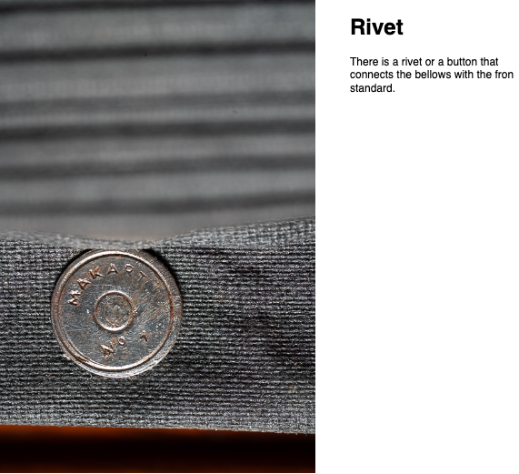
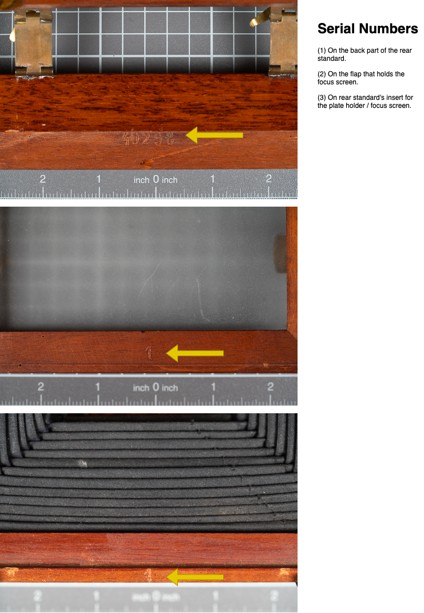
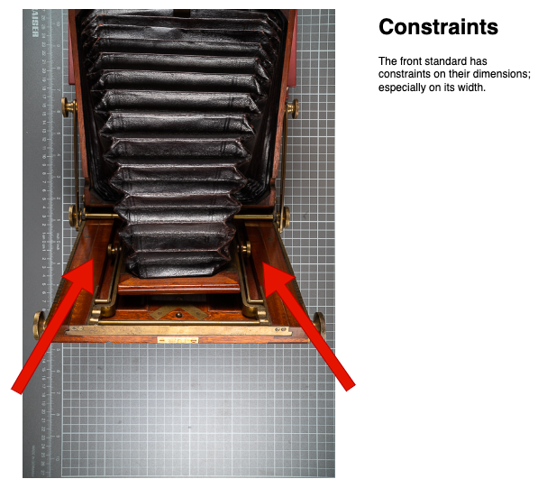
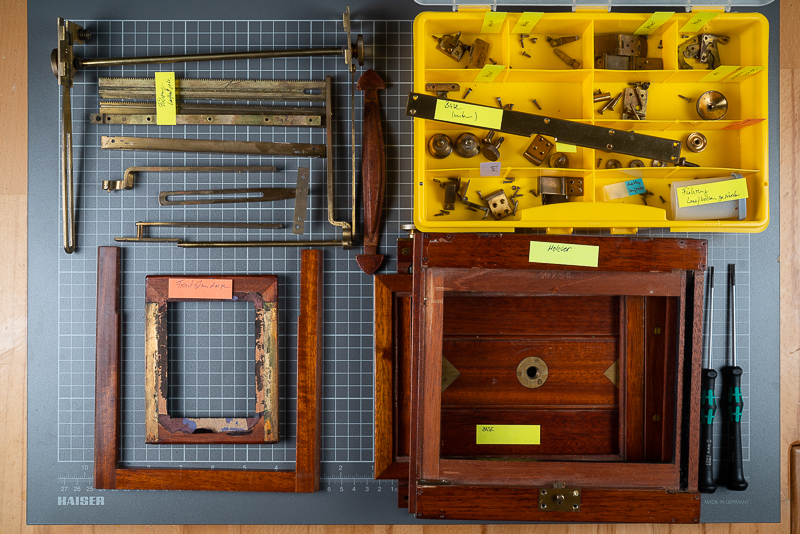

# Restoration of an ancient Camera

## Table of Contents

- [Restoration of an ancient Camera](#restoration-of-an-ancient-camera)
  - [Table of Contents](#table-of-contents)
  - [Intro](#intro)
  - [Who built the Cam?](#who-built-the-cam)
    - [Findings](#findings)
      - [Rivet joining Front Standard with Bellows](#rivet-joining-front-standard-with-bellows)
      - [Serial Numbers](#serial-numbers)
      - [Dimensional Constraints](#dimensional-constraints)
    - [Conclusion](#conclusion)
  - [Camera Map](#camera-map)
  - [Next Steps](#next-steps)

## Intro

I bought a 13x18 camera [^1]. An unknown (brand) one. A wooden one. A beautiful one. It’s old. It has some scratches. However, each beauty deserves to survive and hence, it needs some restoration. This repository will collect all information I can find about the cam, as well as a plan to refurbish it.

_Click the pic to watch a small youtube video about the cam:_

## Who built the Cam?

At time of purchase and at present, the maker is unknown to me. It's clear 

This chapter will collect all indicators that may point to an known maker/brand.

### Findings

This section contains all findings that might give indicators about the origin of the cam.

#### Rivet joining Front Standard with Bellows

There is a rivet joining the front standard with the bellows. The rivet doesn't make any sense; neither functionally nor technically. The imprint is: __MAKART № 1__.

In case this is the "camera brand" it might be an indicator for an individual custom built.

#### Serial Numbers

The cam contains some serial numbers. One inside the focus screen flap. It is stamped in as: "40298".

If this number is a correlation with the number of pieces built, then it would speak for an established brand with higher production quantities. However, the number _is not_ printed directly on the camera body but on the plate holder. This part is exchangeable and the serial number tends more to belong to the plate holder but not to the camera.

There plenty of "1" numbers stamped into parts:
* All single wooden parts have a "1" stamp,
* as well as some brass parts do.

My assumption is that this was a number system used by the makers to not confuse the parts, which had been individually be built for each cam. However, this system is likely only practical either with one or two digits. It's likely that there had be max 9 cameras be in the making at the same time.

#### Dimensional Constraints

The front standard is unusual "slim" regarding its width. This is due constructional constraints in the folding mechanism; between the standard and the cam base. There is not much space to have a standard with more width.

### Conclusion

According to a discussions in [großformatfotografie.de](https://forum.grossformatfotografie.de/forum/thread/20896-infos-zu-einer-alten-holzkamera-gesucht)[^2] evidence is slowly emerging that the camera was built in an Austria  by the maker __R. A. Goldmann Fabrik Photographischer Apparate__ [^3], in a workshop based in Vienna. It's not that I found a 100% proof but there are a couple of indicators pointing to it:

* I bought the camera from an Austrian dealer
* Many specific details can be seen on Goldmann cameras as well, like these:
  * [8x10 Goldmann](https://forum.grossformatfotografie.de/forum/thread/15742-8x10-goldmann-reisekamera-mit-carl-zeiss-protarlinse-viii-41cm-mit-holzkassette/) with design similarities:
    * The plate holder on pic1 has a similar shape
    * The plate holder frame with focus screen flap has a very similar design
    * In this [Goldmann Studio Camera](https://collectiblend.com/Cameras/Goldmann/Studio-Camera-%28Atelierkamera%29.html) (pic 3) you see
      * a very specific lens board mount that can be seen at other Goldmann cameras as well, and at the unknown camera, too
    * This [Goldmann](http://www.photohistory.at/goldmann1890.jpg) has a similar curved construction of the "front standard arms". These "curved arms" are applied due to construction contraints of the base board and folding mechanism; like at the unknown camera.
  * In many Goldmann camera variants the construction of the base board with its moving part looks very identical.

All these indicator are not bullet proof but a good approximation to the maker.

## Camera Map

## Next Steps

The camera is now dismantled:

__The following steps are planed__:

* Conversion to a 5x7 camera
* Conversion of the front standard with Linhof Technika mount (eventually this requires a completely new front standard)
* New focus screen
* New bellows
* Built of wooden 5x7 holders
* Wood repair and re-varnishing (actually the wood is in excellent condition)
* Refurbishing all brass parts
* Refurbishing all lether parts

[^1]: A 13x18 ratio sounds weird? These are centimeters. The corresponding inch ratio is 5x7.
[^2]: Board discussions: [largeformatphotography.info](https://www.largeformatphotography.info/forum/showthread.php?171542-Looking-for-information-about-an-old-wooden-LF-Cam), [großformatfotografie.de](https://forum.grossformatfotografie.de/forum/thread/20896-infos-zu-einer-alten-holzkamera-gesucht), [Leica forum (en)](https://www.l-camera-forum.com/topic/358442-does-anybody-know-this-cam), [Leica forum (de)](https://www.l-camera-forum.com/topic/358441-kenn-jemand-die-kamera), [Blende/Zeit Forum](https://blende-und-zeit.sirutor-und-compur.de/thread.php?board=1&thread=212&page=1#1)
[^3] R. A. Goldmann Fabrik Photographischer Apparate [camera-wiki.org/wiki/Goldmann](http://camera-wiki.org/wiki/Goldmann)