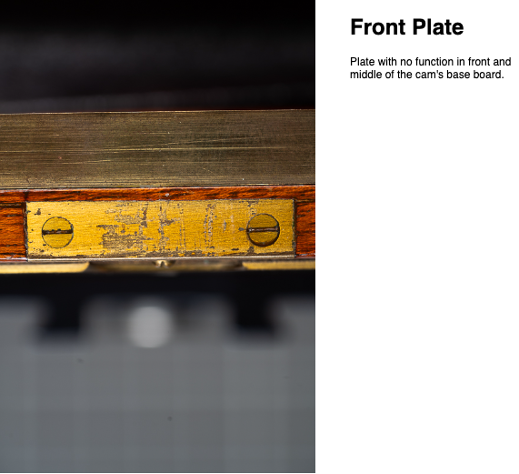

# Restoration of an ancient Camera

## Table of Contents

- [Restoration of an ancient Camera](#restoration-of-an-ancient-camera)
  - [Table of Contents](#table-of-contents)
  - [Intro](#intro)
  - [Who built the Cam?](#who-built-the-cam)
  - [Findings](#findings)
    - [Rivet connecting Front Standard with Bellows](#rivet-connecting-front-standard-with-bellows)
    - [Serial Numbers](#serial-numbers)
    - [Front Plate](#front-plate)
    - [Dimensional Constraints](#dimensional-constraints)
  - [Camera Map](#camera-map)
  - [Discussions in Camera/Photography Boards](#discussions-in-cameraphotography-boards)

## Intro

I bought a 13x18 camera [^1]. An unknown (brand) one. A wooden one. A beautiful one. It’s old. It has some scratches. However, each beauty deserves to survive and hence, it needs some restoration. This repository will collect all information I can find about the cam, as well as a plan to refurbish it.

_Click the pic to watch a small youtube video about the cam:_

## Who built the Cam?

At time of purchase and at present, the maker is unknown to me. It's clear 

This chapter will collect all indicators that may point to an known maker/brand.

## Findings

This section contains all findings that might give indicators about the origin of the cam.

### Rivet connecting Front Standard with Bellows

There is a rivet joining the front standard with the bellows. The rivet doesn't make any sense; neither functionally nor technically. The imprint is: __MAKART № 1__.

In case this is the "camera brand" it might be an indicator for an individual custom built.

### Serial Numbers

The cam contains some serial numbers. One inside the focus screen flap. It is stamped in as: "40298".

If this number is a correlation with the number of pieces built, then it would speak for an established brand with higher production quantities. However, the number _is not_ printed directly on the camera body but on the plate holder. This part is exchangeable and the serial number tends more to belong to the plate holder but not to the camera.

There are two other numbers; each: "1":
* One on the plate holder
* Another one on the cam body; on the rear standard's insert for the plate holder

These "1"s seem to pair up, meaning that plate holder and body belong together. This reminds me on Hasselblad film back, where the film back and its insert share the same serial number, meaning they belong together.

### Front Plate

The camera body has a front plate. This plate has no function. Scratches on it indicate some letters: "? H I".

### Dimensional Constraints

The front standard is unusual "slim" regarding its width. This is due constructional constraints in the folding mechanism; between the standard and the cam base. There is not much space to have a standard with more width.

## Camera Map

## Discussions in Camera/Photography Boards

Discussions in photography formuns [^2].

[^1]: A 13x18 ratio sounds weird? These are centimeters. The corresponding inch ratio is 5x7.
[^2]: Board discussions: [largeformatphotography.info](https://www.largeformatphotography.info/forum/showthread.php?171542-Looking-for-information-about-an-old-wooden-LF-Cam), [großformatfotografie.de](https://forum.grossformatfotografie.de/forum/thread/20896-infos-zu-einer-alten-holzkamera-gesucht), [Leica forum (en)](https://www.l-camera-forum.com/topic/358442-does-anybody-know-this-cam), [Leica forum (de)](https://www.l-camera-forum.com/topic/358441-kenn-jemand-die-kamera), [Blende/Zeit Forum](https://blende-und-zeit.sirutor-und-compur.de/thread.php?board=1&thread=212&page=1#1)